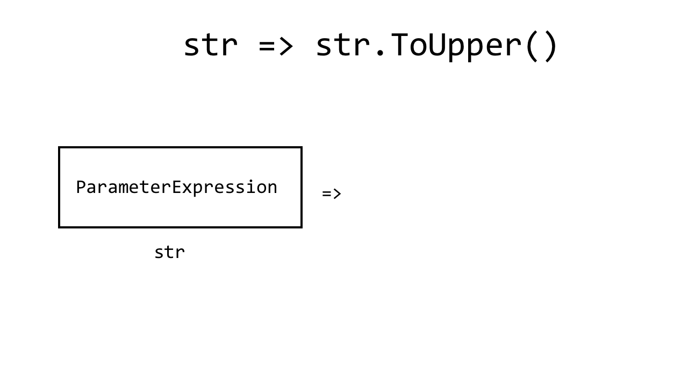
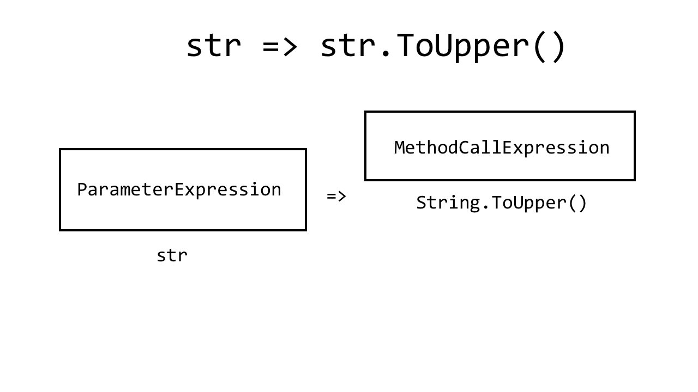

### C# <span style="color: #e49436">Expression Trees</span> in the <span style="color: #e49436">Real World</span>

#####  Spencer Schneidenbach

[@schneidenbach](https://twitter.com/schneidenbach)  

---

Twitter [@schneidenbach](https://twitter.com/schneidenbach)  

## Slides plus more at

ss.zone/expressions

---

## <span class="orange">Have you ever been asked to:</span>
* Query a database with a LINQ expression?

```csharp
from product in db.Products
where product.Price < 2.55
select new {
    product.Name,
    product.Price
}
```

---

## <span class="orange">Have you ever been asked to:</span>
* Select one or more specific members from an object?

```csharp
ForMember(x => x.Name)
```
---

<span class="orange">Guarantee</span>: if you've done this

```csharp
x => x.Name
```

you've used <span class="orange">expression trees</span>

---

even if you had no idea

---

### What are <span class="orange">expression trees?</span>

---

We should start first by discussing <span class="orange">lambdas</span>

---

### Lambda expressions

```csharp
Func<string, string> toUpper = str => str.ToUpper();

var result = toUpper("spencer");
```

---

### Lambda expressions

```csharp
Func<string, string> toUpper = str => str.ToUpper();

var result = toUpper("spencer");    //SPENCER
```

---

### Lambda expressions

```csharp
Expression<Func<string, string>> toUpper = str => str.ToUpper();

var result = toUpper("spencer");
```

---

### Lambda expressions

```csharp
Expression<Func<string, string>> toUpper = str => str.ToUpper();

var result = toUpper("spencer");    //doesn't compile!
```

---

### Lambda expressions

```csharp
Expression<Func<string, string>> toUpper = str => str.ToUpper();

var result = toUpper("spencer");    //doesn't compile!
```

---

## What the heck?

```csharp
Expression<Func<string, string>> toUpper = str => str.ToUpper();
```
## vs.
```csharp
Func<string, string> toUpper = str => str.ToUpper();
```

---

## Key difference

<span class="orange">Lambdas</span> do the thing  
<span class="orange">Expressions</span> describe the lambda that does the thing

---

```csharp
Func<string, string> toUpper 
    = str => str.ToUpper();

Expression<Func<string, string>> toUpperExp
    = str => str.ToUpper();
```

---

### <span class="orange">Homoiconicity</span>

---

### <span class="orange">Homoiconicity</span>

```csharp
Func<string, string> toUpper 
    = str => str.ToUpper();

Expression<Func<string, string>> toUpperExp
    = str => str.ToUpper();
```

---

### So what can we do with expressions?

1. **Read them**
2. Use them
3. Create them

---

### Lambda expressions

```csharp
Expression<Func<string, string>> toUpper 
    = str => str.ToUpper();
```

---


---



---



---


---

### So what can we do with it?

1. Read them (more on that later)
2. **Use them**
3. Create them

---

### Use them

```csharp
Expression<Func<string, string>> toUpper 
    = str => str.ToUpper();

var result = toUpper.Compile().Invoke("spencer");    //SPENCER
```

---

### So what can we do with it?

1. Read them (more on that later)
2. Use them
3. **Create them**

---

## Create them

```csharp
Expression<Func<string, string>> toUpper 
    = str => str.ToUpper();
```

---

## Create them

```csharp
Expression<Func<string, string>> toUpper 
    = str => str.ToUpper();
```

Useful, but mostly for libraries to read them

---

## Create them... at runtime?

---

## `Expression` API

---

## `Expression` API

You can build expressions at runtime very easily

---

## `x => "Hello, " + x.LastName`

Functions have:
* Parameters
* Body

---

### <span class="orange">`ParameterExpression`</span>

Describes a parameter to a function

```csharp
Expression.Parameter(typeof(string));
Expression.Parameter(typeof(string), "myStr");  //with a name
```

---

### <span class="orange">`ConstantExpression`</span>

Represents a constant (e.g. 1, "str", etc)

```csharp
Expression.Constant("spencer");
```

---

### <span class="orange">`MethodCallExpression`</span>

Represents a call to a method

```csharp
var prm = Expression.Parameter(typeof(string));
var toUpper = typeof(string).GetMethod("ToUpper", Type.EmptyTypes);

Expression.Call(prm, toUpper);
```

---

## Let's build this guy!

```csharp
Expression<Func<string, string>> toUpper = str => str.ToUpper();
```

---

## `str => str.ToUpper()`

```csharp
var prm = Expression.Parameter(typeof(string));
var toUpper = typeof(string).GetMethod("ToUpper", Type.EmptyTypes);

var body = Expression.Call(prm, toUpper);

var lambda = Expression.Lambda(body, prm);
```
@[1]
@[2]
@[4]
@[6]

---

## Two ways to run your lambda

```csharp
var lambda = Expression.Lambda(body, prm);
lambda.Compile().DynamicInvoke("spencer");  //not strongly typed
```

---

## Two ways to run your lambda

```csharp
var lambda = Expression.Lambda<Func<string, string>>(body, prm);
lambda.Compile().Invoke("spencer");         //strongly typed
```

---

### So what can we do with it?

1. Read them
2. Use them
3. Create them

---

## The <span class="orange">Real World</span>

---

## Your favorite libraries
* Entity Framework
* AutoMapper

---

## <span class="orange">Entity Framework</span>

Translates expressions to SQL

---

## <span class="orange">Entity Framework</span>

```csharp
var products = db.Products
    .Where(p => p.Name == "eggs")
    .OrderByDescending(p => p.Price);
```

---

## <span class="orange">Entity Framework</span>

```csharp
var products = db.Products
    .Where(p => p.Name == "eggs")
    .OrderByDescending(p => p.Price);
```

```sql
SELECT * FROM Products
WHERE Name = 'eggs'
ORDER BY Price DESC
```

---

## <span class="orange">Entity Framework</span>

```csharp
var products = db.Products
    .Where(p => p.Name == "eggs")
    .OrderByDescending(p => p.Price);
```
## ?
```sql
SELECT * FROM Products
WHERE Name = 'eggs'
ORDER BY Price DESC
```

---


---

## <span class="orange">Entity Framework</span>

```csharp
var products = db.Products
    .Where(p => p.Name == "eggs")
    .OrderByDescending(p => p.Price);
```

db.Products is an `IQueryable`

---

## <span class="orange">`Queryable`</span> vs. <span class="orange">`Enumerable`</span>

---

## `Enumerable`

```csharp
Enumerable<T>.Where(Func<T, bool> predicate)
```

---

## `Queryable`

```csharp
Queryable<T>.Where(Expression<Func<T, bool>> predicate)
```

---

## `Queryable`

```csharp
Queryable<T>.Where(Expression<Func<T, bool>> predicate)
```

This one can be interpreted at runtime!

---

## <span class="orange">Entity Framework</span>

```csharp
var products = db.Products
    .Where(p => p.Name == "eggs")
    .OrderByDescending(p => p.Price);
```

---

## <span class="orange">`ExpressionVisitor`</span>

Used to read and operate on expressions

---

## <span class="orange">Entity Framework</span>

```csharp
var products = db.Products
    .Where(p => p.Name == "eggs")
    .OrderByDescending(p => p.Price);
```

---

```csharp
.Where(p => p.Name == "eggs")
```
## becomes
```sql
WHERE Name = 'eggs'
```

---

```csharp
p => p.Name == "eggs"   //this is a binary expression
```

---

### <span class="orange">`BinaryExpression`</span>

Represents an operation with a left side, right side, and operator

---

### <span class="orange">`BinaryExpression`</span>

| Property | What is it? |
| --- | --- |
| Left | Expression |
| Right | Expression |
| NodeType | Equal, NotEqual, etc. |

---

## <span class="orange">AutoMapper</span>

Selectors

---

## <span class="orange">AutoMapper</span>

```csharp
config.CreateMap<Employee, EmployeeModel>()
    .ForMember(c => c.FirstName, t => t.MapFrom(g => g.MyFirstName));
```

---

## <span class="orange">AutoMapper</span>

```csharp
config.CreateMap<Employee, EmployeeModel>()
    .ForMember(c => c.FirstName, t => t.MapFrom(g => g.MyFirstName));
```

Uses the expressions as selectors

---

## <span class="orange">AutoMapper</span>

# `ProjectTo`

---

## Consider this

```csharp
public class ItemDetail
{
    public int Id { get; set; }
    public string Name { get; set; }
    //literally 100 other properties
}
```

---

## Consider this

```csharp
//only two properties
public class ItemDetailModel
{
    public int Id { get; set; }
    public string Name { get; set; }
}
```

---

## <span class="orange">AutoMapper</span> + <span class="orange">EF</span>

```csharp
var itemDetails = Mapper.Map<ItemDetailModel[]>(db.ItemDetails);
```

---

## <span class="orange">AutoMapper</span> + <span class="orange">EF</span>

```csharp
var itemDetails = Mapper.Map<ItemDetailModel[]>(db.ItemDetails);
```

Here be dragons!

```sql
SELECT * FROM ItemDetails
```

---

## <span class="orange">`ProjectTo`</span> to the rescue

```csharp
db.ItemDetails.ProjectTo<ItemDetailModel>();
```

---

## `ProjectTo` to the rescue

```csharp
db.ItemDetails.ProjectTo<ItemDetailModel>();
```

```sql
SELECT ID, Name FROM ItemDetails
```

---

# My real world

---

## SQL Model Mapper

Needed to map one entity to another  
Stored procs vs. code

---

## SQL Model Mapper

SalesForce Customer -> Quickbooks Customer

---

```csharp
public class SalesForceCustomer
{
    public string CustomerName { get; set; }
    public DateTime? CreateDate { get; set; }
}

public class QuickbooksCustomer
{
    public string Name { get; set; }
    public DateTime? OpenDate { get; set; }
}
```

---

## Stored procs

```sql
INSERT QuickbooksCustomers (Name, OpenDate)
SELECT CustomerName, CreateDate
FROM SalesForceCustomers
```

---

## Stored procs

```sql
INSERT QuickbooksCustomers (Name, OpenDate)
SELECT CustomerName, CreateDate
FROM SalesForceCustomers
```

Now do that for 100's of object and 1000's of properties, and don't make a mistake

---

## Expressions to the rescue

---

```csharp
public class SfCustomerToQbCustomer
{
    public SfCustomerToQbCustomer()
    {
        SourceField(sfc => sfc.CustomerName)
            .IsEqualTo(qbc => qbc.Name.Trim());
        SourceField(sfc => sfc.CreateDate)
            .IsEqualTo(qbc => qbc.OpenDate ?? DateTime.Now);
    }
}
```

---

## Tasks

1. Write an `ExpressionVisitor`
2. Handle any type of expression we want to translate

---

```csharp
qbc => qbc.Name.Trim()
```
## to
```sql
LTRIM(RTRIM(Name))
```

---

Emitted nice looking SQL

```sql
INSERT QuickbooksCustomers (Name, OpenDate)
SELECT LTRIM(RTRIM(CustomerName)), ISNULL(CreateDate, GETDATE())
FROM SalesForceCustomers
```

---

Predicatable

---

Saved 1000's of hours of developer time

---

## Order By... string?

---

`api/Customers?orderBy=name`

---

```csharp
db.Customers.OrderBy(c => c.Name)
```

---

```csharp
db.Customers.OrderBy("Name")    //doesn't exist
```

---

## Solution: cook an <span class="orange">expression</span>!

---

## Goal

```csharp
OrderBy(c => c.Name)
```

---

```csharp
IQueryable<T> OrderByPropertyOrField<T>(
    this IQueryable<T> queryable, 
    string propertyOrFieldName, 
    bool ascending
)
```

---

1. Cook our expression
2. Apply it to our Queryable chain

---

## `c => c.Name`

```csharp
IQueryable<T> OrderByPropertyOrField<T>(
    this IQueryable<T> queryable, 
    string propertyOrFieldName, 
    bool ascending
)
{
    var elementType = typeof (T);
    var parameter = Expression.Parameter(elementType);
    var prop = Expression.PropertyOrField(parameter, propertyOrFieldName);
    var selector = Expression.Lambda(prop, parameter);
```
@[7]
@[8]
@[9-10]
@[11]

---

## Goal

```csharp
OrderBy(c => c.Name)
```

---

## `Queryable`

```csharp
Queryable.OrderBy<TSource, TKey>(IQueryable<TSource>, Expression<Func<TSource, TKey>>)
```

---

## `Queryable.OrderBy<TSource, TKey>(IQueryable<TSource>, Expression<Func<TSource, TKey>>)`

```csharp
var selector = Expression.Lambda(prop, parameter);

var orderByMethodName = ascending ? "OrderBy" : "OrderByDescending";
var orderByExpression = Expression.Call(
    typeof (Queryable),     //the type whose function we want to call
    orderByMethodName,      //the name of the method
    new[] {elementType, prop.Type},    //the generic type signature 
    queryable.Expression,   //parameter
    selector);              //parameter
```
@[3]
@[4-9]
@[5]
@[6]
@[7]
@[8-9]

---

## Other things
* Expressions vs. reflection
* Rules engine

---

## Here be dragons

---

### Remember, C# compiler does magic

---

```csharp
Expression<Func<string, string, string>> combineStrings = 
    (str1, str2) => str1 + str2;
```

---

```csharp
var str1Param = Expression.Parameter(typeof(string));
var str2Param = Expression.Parameter(typeof(string));

var combineThem = Expression.MakeBinary(ExpressionType.Add, str1Param, str2Param);
```

---

```csharp
var str1Param = Expression.Parameter(typeof(string));
var str2Param = Expression.Parameter(typeof(string));

var combineThem = Expression.MakeBinary(ExpressionType.Add, str1Param, str2Param);
```

EXCEPTION: The binary operator Add is not defined for the types 'System.String' and 'System.String'

---

```csharp
Expression<Func<string, string, string>> combineStrings = 
    (str1, str2) => str1 + str2;
```

This uses string.Concat

---

Conversions have to be handled explicitly

---

### More resources

ss.zone/expressions

---

## Thank you!

[@schneidenbach](https://twitter.com/schneidenbach)  
schneids.net